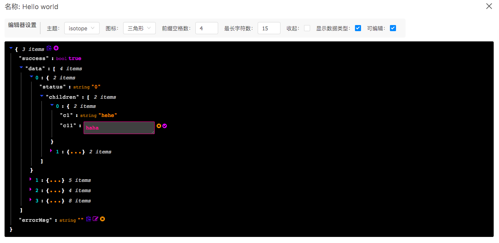
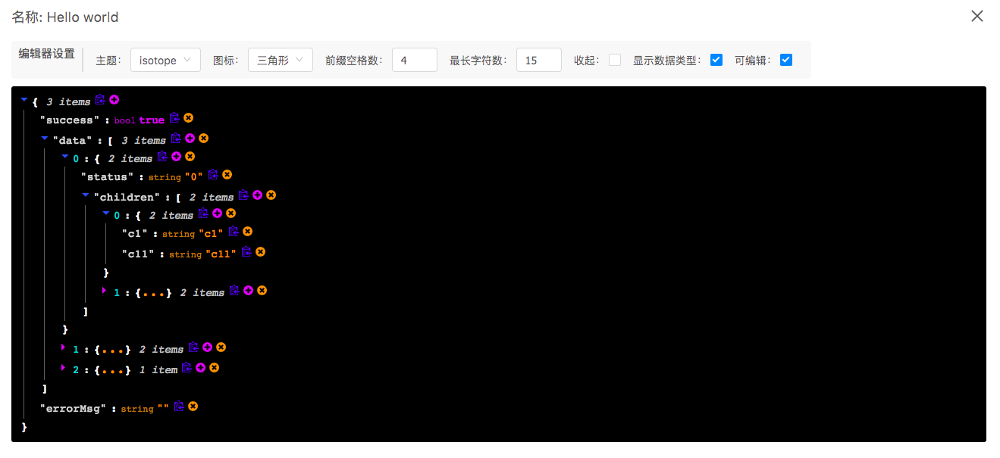

# Json 可视化编辑器



## Features
1. 支持两种常用场景的调用：COMPONENT | PAGE
2. json可视化编辑 & localStorage中存储
  - 对JSON数据进行编辑，包括增删改等
  - 以指定名称空间(默认为jsonEditor)将json数据存储到 localStorage中
  - 对多份json数据的编辑，分别以指定的 key-jsonData 的方式将数据存储到localStorage相应的名称空间下
3. 通过可视化设置工具栏配置展示方式 和 操作权限
4. COMPONENT 预览模式，默认收起，可点击json编辑触发键 or preview触发键 触发json编辑面板
5. PAGE页面中支持 从本地文件导入、导出到本地文件等功能

## 使用
### 下载 & 安装
1. download
2. npm install
3. http://127.0.0.1:8000/index.html

### 调用
DEMO 见 http://127.0.0.1:8000/index.html

1. 业务页面中以组件的方式调用

```
<JsonEditor
    mode="COMPONENT"
    status={"open or close"}
    onToggle={this.toggle}
    header={<p key="jsonEditorHeader">Hello world</p>}
/>
```
2.独立的 json-editor 管理页面中

```
<JsonEditor
    mode="PAGE"
    status={"open or close"}
    onToggle={this.toggle}
    header={<p key="jsonEditorHeader">Hello world</p>}
/>
```

